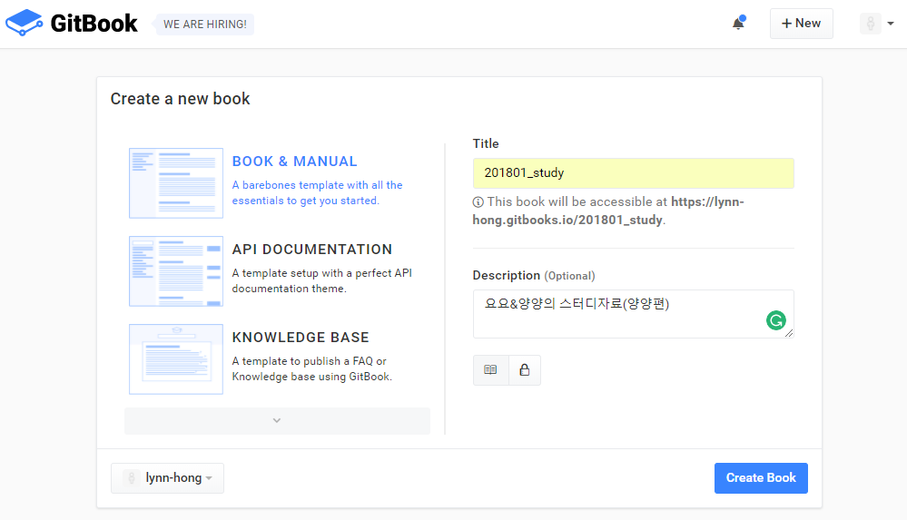

## gitbook을 github과 함께 사용하기

### gitbook 프로젝트 생성

* _**모든 이미지는 텍스트 설명을 부연하기 위한 것으로, 각 텍스트 설명 아래의 이미지를 참고하시면 됩니다.**_

---

* [gitbook](http://gitbook.com)에 가입하고 좌측 상단의 +new 버튼을 클릭한다. 
  만들고자 하는 페이지의 종류를 선택\(여기에서는 'BOOK&MANUAL'\)

* 아래와 같이 빈 깃북이 생성된다.

* 'SETTINGS&gt;GITHUB'을 눌러 깃헙 계정과 연동한다. 

* github으로 가서 새로운 repository를 하나 생성한다.\(gitbook과 연동할 목적\)

* gitbook에서 연동할 repo를 선택하고 sync한다.

* 이 때 아래 그림처럼 양쪽의 컨텐츠가 불일치해 오류가 나지만 컨텐츠를 추가해 넣을 예정이므로 github을 기준으로 동기화한다.

* 아래 그림처럼 github을 기준으로 gitbook 컨텐츠가 바뀌었다!

* 이제 다음은 github 프로젝트 내의 `doc` 디렉토리를 gitbook으로 만들어볼 차례!

