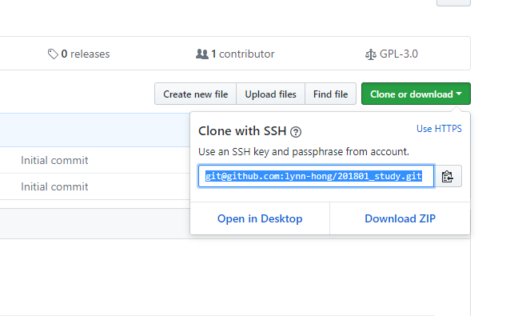
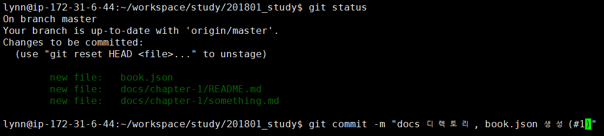
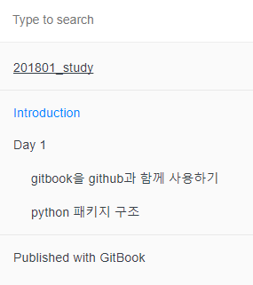

## docs 디렉토리를 gitbook으로 만들기

- 연동해 둔 github repo로 가서 주소를 복사하여 clone한다.
리눅스의 경우 [이 블로그](https://hojunpark.wordpress.com/2015/01/06/%EA%B9%83%ED%97%99github%EC%97%90-ssh-%ED%82%A4-%EB%A7%8C%EB%93%A4%EA%B3%A0-%EB%93%B1%EB%A1%9D%ED%95%98%EA%B8%B0/)를 참고하여
ssh key를 등록해 편하게 내려받을 수 있다. (맥도 아마도 비슷..?)



``` bash
git clone git@github.com:[github 닉네임]/[repo 이름].git
```

- 내려받은 git 프로젝트에 아래와 같은 구조로 디렉토리와 파일들을 만들어준다.
여기서 `docs` 디렉토리가 gitbook과 연동하여 설명서 부분이 될 곳이다.

``` bash
.
|-- book.json
|-- README.md
|-- docs
   |-- chapter-1
      |-- img
         |-- 1.jpg
      |-- contents.md
      |-- READMD.md
   |-- README.md
   |-- SUMMARY.md
```



- `docs/SUMMARY.md` 에 아래와 같이 목록을 만들어 준다. 여기서 만든 목록대로 gitbook 좌측의 목차가 생성된다.

```markdown
# Summary

* [Day 1](chapter-1/README.md)
    * [gitbook을 github과 연동하기](chapter-1/gitbook.md)
    * [docs 디렉토리를 gitbook으로 만들기](chapter-1/gitbook_structure.md)
    * [python 패키지 구조](chapter-1/python_package.md)
```


- 위에서 설명한 바와 같이 디렉토리 구조를 만들었다면 이미지 링크를 걸 때는 다음과 같이 걸어주어야 한다. 
- 이미지 파일명은 확장자의 대소문자도 구별해주어야 한다.

```markdown

```

- 이렇게 필요한 컨텐츠들을 제작하여 `docs` 디렉토리에 넣어주고,
나머지 코드나 리소스들은 루트 위치에서 `pysrc` 등의 이름으로 추가해주면 된다.
- 이제 다음은 이 프로젝트에 실제 python 패키지를 추가해 볼 차례!

### Reference
- [gitbook toolchain](https://toolchain.gitbook.com/structure.html)
- [gitbook toolchain 한국어 번역 페이지](https://tinydew4.gitbooks.io/gitbook/content/ko/structure.html)
