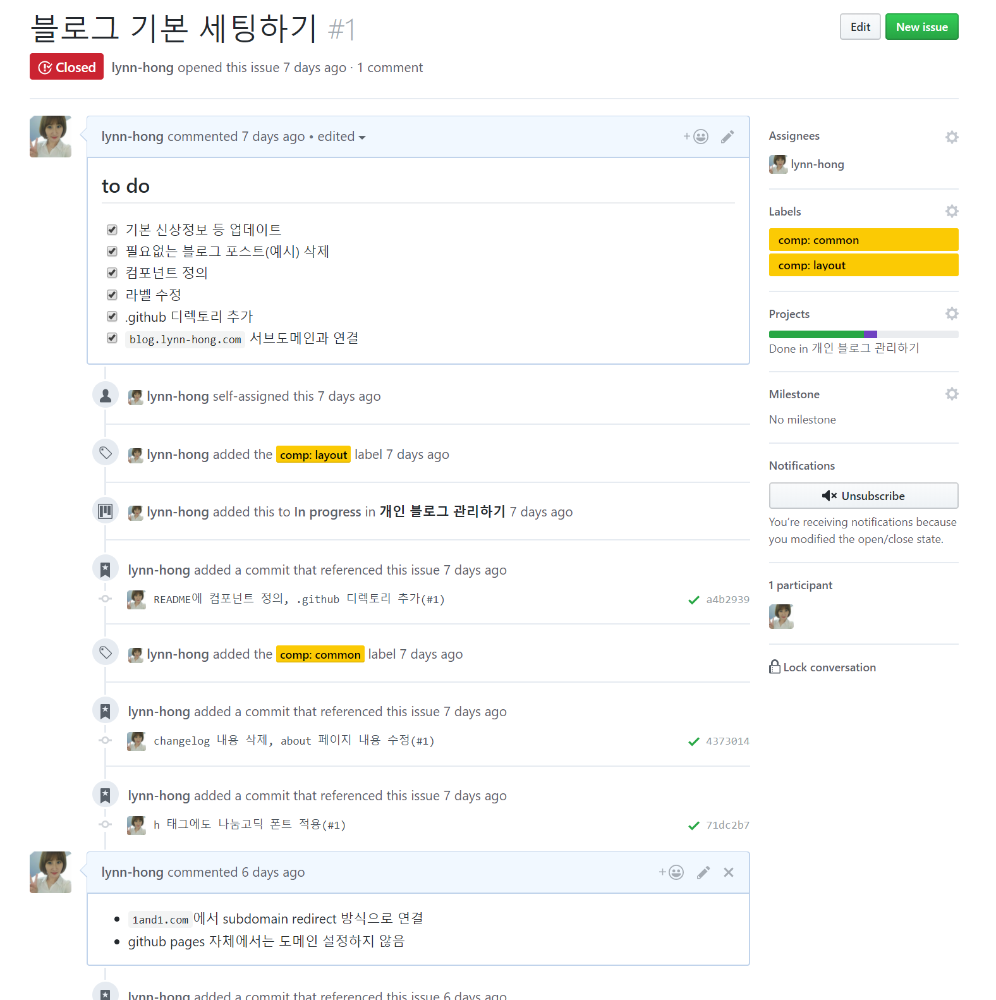
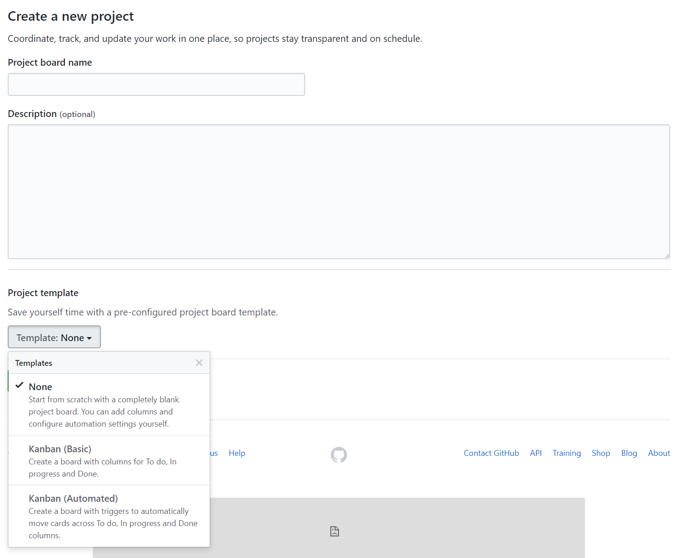
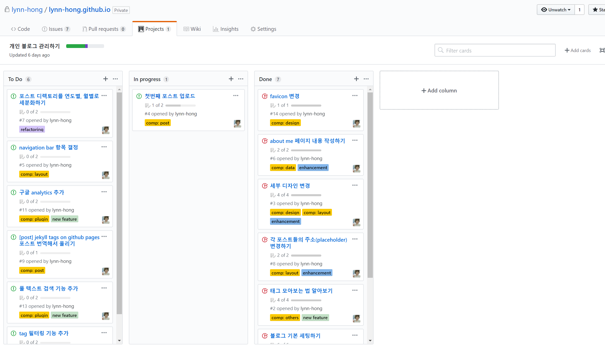

## 프로젝트 관리

### 이슈 기반 프로젝트 관리
- 일반적으로 github으로 프로젝트를 진행할 때 commit은 무조건 이슈에 기반하여 이루어져야 한다!
- 소스에 변경을 주고 싶다면 아래 순서로 진행되어야 함
  1. 이슈 생성
  2. `master`를 베이스로 해당 이슈 번호로 새로운 브랜치 생성(이슈 브랜치)
  3. 코드 수정
  4. commit 메시지에 이슈번호를 기록하여 commit(이슈 브랜치로)
  5. 이슈 브랜치에서 `master`로 pull request 보냄
  6. `master`에서 권한이 있는 관리자가 리뷰 후 merge
  7. merge 후 관리자가 이슈 브랜치 삭제하기도 하고 브랜치 생성자가 삭제하기도 함

- 한두명이 관리하는 소스의 경우 꼭 위의 과정을 모두 따라야 하는 건 아니지만 1, 3, 4 과정은 필수!
- 아래 사진처럼 라벨링과 프로젝트 연동도 꼭 해주면 편하다!

  

### github 프로젝트 관리
- github의 또 하나의 중요 기능은 프로젝트 관리
- repository에서 탭 중 'Projects'를 클릭하고 'New project'로 생성
- template에서 kanban(basic)이나 kanban(automated)로 선택한다

  

- 이슈를 프로젝트 페이지에서 생성할 수도 있고 거꾸로 이슈를 프로젝트에 배정할 수도 있다. 하나의 이슈를 여러개의 프로젝트에 중복 배정할 수 있음.

  