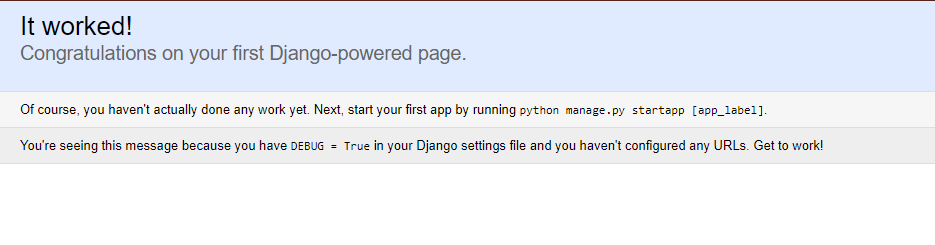

## model 생성과 데이터베이스 연결

### MySQL 데이터베이스
우리는 MySQL을 사용할 거에요.
django에서 복수의 데이터베이스를 사용하려면 복잡한 설정을 해 주어야 해요.
개인 포트폴리오 사이트는 DB에 저장할 내용이 많지 않아 SQLite를 써도 무방하지만,
나중에 다른 용도의 사이트에서 많은 데이터를 화면에 뿌려줄 때를 생각한다면
본인이 사용하기 편한 다른 DBMS를 쓰는 게 좋을 수 있어요.
 
MySQL 외에도 다른 많은 DBMS가 있으니 튜토리얼을 참고하여 각자에게 편한 것을 사용하시면 돼요. 
혹시 MySQL이 설치되어있지 않은 분들은 [이런 포스트](https://www.digitalocean.com/community/tutorials/how-to-install-mysql-on-ubuntu-14-04)들을
참고해서 설치를 해 주세요. 이 예시는 리눅스 ubuntu 기준이랍니다.

>만약 MySQL 사용법을 잘 몰라서 설치가 필요 없는 SQLite를 사용하고 싶은 분들은 이 페이지와 다음 페이지를 스킵하고
[장고걸스 튜토리얼](https://tutorial.djangogirls.org/ko/django_start_project/)대로 따라해주세요.


### DB 생성, `pymysql` 설치
우선 MySQL 워크벤치를 이용하거나 커맨드라인에서 SQL shell에 접속해서
DB를 하나 생성해주세요. 아래 명령어는 shell에서 'MYSITE'라는 이름의 DB를 직접 생성하는 경우입니다.
생성 후 다시 shell에서 빠져나오세요.
```sql
mysql> CREATE DATABASE MYSITE;
```

다음은 python 스크립트에서 이 데이터베이스에 접속할 수 있도록 해주는 패키지를 설치할 차례에요.
우리는 `pymysql` 패키지를 사용할 예정이에요. 다음과 같은 명령어를 실행해주세요.
```bash
(django) ~/django$ pip install pymysql
```


### DB 접속정보 파일 생성
스크립트에서 자동으로 데이터베이스에 접속할 수 있도록 접속정보를 기록한 `mysql.cnf` 파일을 제작할거에요.
`mysite/mysql.cnf` 파일을 하나 만드시고 아래 내용을 넣어주세요.
{ } 부분은 실제 접속정보로 채워주셔야 해요.
```ini
[client]
database = {내 DB 이름}
host = {DB 호스트 IP. local인 경우 'localhost'라고 적음}
user = {DB 유저네임}
password = {DB 비밀번호}
default-character-set = {적절하게 utf8 등 설정}
```
>본 튜토리얼 소스코드에는 실제 `mysite/mysql.cnf` 파일은 넣어두지 않고
`mysite/mysql_sample.cnf` 파일을 넣어두었어요. 그 파일을 수정해서 사용하셔도 됩니다!


### `settings.py` 수정하기
앞서 한 번 수정했던 `mysite/settings.py`에 DB 부분을 수정해 줄 차례에요.
우선 상단 `import` 부분에 `pymysql` 패키지를 추가해주어야 해요.
`import os` 바로 밑에 아래 다섯 줄을 추가해주세요.
```python
try:
    import pymysql
    pymysql.install_as_MySQLdb()
except:
    pass
```

그리고 쭉 내려가서 `DATABASES`라는 항목을 아래와 같이 변경해주세요.
`{mysql.cnf 파일의 절대경로}` 부분을 실제 경로로 바꾸어주세요!
```python
DATABASES = {
    'default': {
        'ENGINE': 'django.db.backends.mysql',
        'OPTIONS': {
            'read_default_file': '{mysql.cnf 파일의 절대경로}',
            'sql_mode': 'traditional',
            'init_command': 'SET foreign_key_checks = 0;',
        },
    }
}
```


### 서버 구동하기
django 루트 디렉토리로 이동해서 아래 명령어를 실행해주세요.
오류가 없다면 그 밑에 있는 것처럼 `migrate`이 수행될거에요.
```bash
(django) ~/django$ python manage.py migrate

Operations to perform:
  Synchronize unmigrated apps: messages, staticfiles
  Apply all migrations: admin, sessions, contenttypes, auth
Synchronizing apps without migrations:
  Creating tables...
    Running deferred SQL...
  Installing custom SQL...
Running migrations:
  Rendering model states... DONE
  Applying contenttypes.0001_initial... OK
  Applying auth.0001_initial... OK
  Applying admin.0001_initial... OK
  Applying contenttypes.0002_remove_content_type_name... OK
  Applying auth.0002_alter_permission_name_max_length... OK
  Applying auth.0003_alter_user_email_max_length... OK
  Applying auth.0004_alter_user_username_opts... OK
  Applying auth.0005_alter_user_last_login_null... OK
  Applying auth.0006_require_contenttypes_0002... OK
  Applying sessions.0001_initial... OK
```

MySQL 데이터베이스에 들어가 보면 아래와 같이 기본 테이블들이 생성된 것을 확인할 수 있어요. 
```sql
mysql> SHOW TABLES;
+----------------------------+
| Tables_in_MYSITE_TUTORIAL  |
+----------------------------+
| auth_group                 |
| auth_group_permissions     |
| auth_permission            |
| auth_user                  |
| auth_user_groups           |
| auth_user_user_permissions |
| django_admin_log           |
| django_content_type        |
| django_migrations          |
| django_session             |
+----------------------------+
10 rows in set (0.00 sec)
```

다시 django 루트 디렉토리로 돌아와서 아래 명령어를 실행해주세요.
```bash
(django) ~/django$ python manage.py runserver {host}:{port}
Performing system checks...

System check identified no issues (0 silenced).
January 24, 2018 - 15:10:36
Django version 1.8, using settings 'mysite.settings'
Starting development server at http://0:8787/
Quit the server with CONTROL-C.
```
`host`와 `port`를 잘 적어주셔야 하는데, 
localhost로 실행하는 경우에는 host에 '127.0.0.1'과 port에 원하는 포트 번호를,
remote 서버에서 실행하는 경우에는 host에 숫자 0, port에 원하는 포트 번호를 적어주세요!

예를 들어, remote AWS 서버에서 8080 포트로 django 서버를 올리고 외부에서 접속하는 경우,
`python manage.py runserver 0:8080`을 실행하시면 됩니다.
> 이 때 접속이 되지 않는다면 remote 서버 쪽에서 해당 포트를 열어두었는지 다시 한 번 확인해주세요!

웹 기본 포트인 80으로 서버를 실행하려고 하면 권한이 없다는 에러가 발생할 수 있습니다.
이 때는 python 실행을 `sudo`로 해 주시면 돼요.

정상적으로 실행이 되었으면 인터넷 브라우저를 켜고 localhost의 경우 127.0.0.1:{port},
원격인 경우 {host IP 주소}:{port}를 쳐서 접속해보세요.
아래와 같은 화면이 나오면 접속 성공이에요!



이제 `model.py`를 생성해볼 차례입니다.
