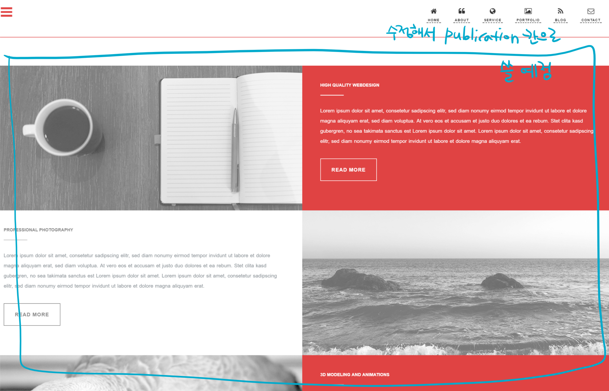

## 모델 생성

***아무리 바빠도 중간중간 github repository에 commit하는 것을 잊지 마세요!***

-----

### django model
django model에 대한 설명은 역시 [장고걸스 튜토리얼](https://tutorial.djangogirls.org/ko/django_models/)에 
잘 나와 있으니 여기에서는 생략하도록 할게요!
model을 정의하는 방법은 `model.py`에 직접 정의 후 자동으로 DB 테이블을 생성해주는 방식과
DB 테이블을 먼저 만든 후 거꾸로 `model.py` 파일을 생성하는 방식이 있어요.

`model.py`를 만든 후 DB로 migration 해 주는 튜토리얼은 많이 있으니
우리는 두 번쨰 방식을 연습해보기로 해요!


### 어플리케이션 생성하기
django 모델을 만들기 전에 어플리케이션 하나를 생성할거에요.
아래 명령어를 실행해서 `portfolio`라는 이름의 어플리케이션을 생성하세요.
```bash
(django) ~/django$ python manage.py startapp portfolio
```

그리고 `mysite/settings.py`에서도 `INSTALLED_APPS` 맨 끝에
'portfolio'라는 이름을 추가해주세요.
```python
INSTALLED_APPS = (
    'django.contrib.admin',
    'django.contrib.auth',
    'django.contrib.contenttypes',
    'django.contrib.sessions',
    'django.contrib.messages',
    'django.contrib.staticfiles',
    'portfolio',
)
```


### 어떻게 model을 정의해야 할까요?
이제 모델을 정의해볼 차례에요. 우리에게 필요한 클래스들은 무엇이 있을까요?
아래와 같은 경우 데이터베이스에 저장해 두고 자동 렌더링 되도록 하는 게 편해요!
- HTML 페이지 소스 내에서 반복이 발생하는 부분들
- 자주 변경되는 내용들

힌트를 얻으려면 우리가 베이스로 사용할 포트폴리오 템플릿을 보면 된답니다.
예를 들면 템플릿의 첫 페이지는 아래와 같이 'John Doe'라는 사람에 대한 묘사로서 
'3D ARTIST', 'PHOTOGRAPHER', 'WEB DESIGNER'가 반복해서 움직이고 있어요.


또는 아래 그림처럼 자신에 대한 소개말도 코드에 직접 박아 넣는 것보다는 DB에서 관리하는 게 수정이 편하겠죠!


그리고 아래와 같이 3개의 항목이 동일한 형태로 반복되는 경우도 모델로 정의해줄 수 있어요!


### 우리가 만들 페이지의 메뉴 구성
우리가 만들 페이지는 대략 아래와 같이 구성될 거에요.
1~5 숫자 표시는 개별 모델 클래스로 정의될 내용을 뜻한답니다.
이 외에도 각자에게 필요한 항목이 있으면 추가하시면 돼요!



