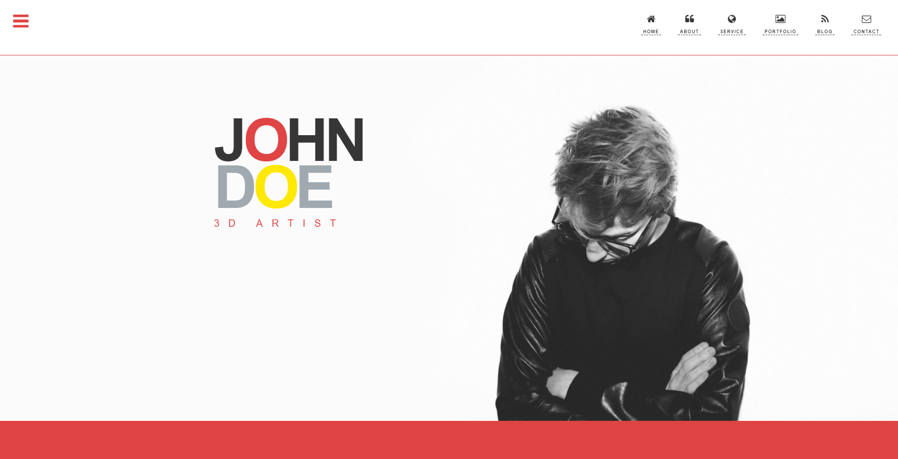

## 포트폴리오 사이트 기획하기

### 템플릿 결정하기
지난 챕터에서 만든 github repository, gitbook 튜토리얼 페이지를 기반으로 
내 포트폴리오 사이트를 제작해볼 예정입니다.

예쁜 디자인을 씌우기 위해 오픈소스로 풀려 있는 html5 템플릿 중 하나를 사용할 거에요.
본 튜토리얼에서 사용한 템플릿 외에도 용도에 따라 많은 무료 템플릿들이 존재합니다
('free html5 portfolio template' 등으로 검색해보세요).
더 예쁘고 interactive한 디자인을 원한다면 '워드프레스 템플릿'으로 검색해서 나오는 유로 템플릿들을 구매해도 좋습니다!

본 튜토리얼에서는 아래 그림과 같은 포트폴리오 템플릿을 사용할 예정입니다.

[여기](https://themewagon.com/themes/johndoe-free-one-page-portfolio-website-template/)로 가서
직접 다운로드를 받으실 수 있어요.
튜토리얼 코드에 변형된 버전 소스를 포함시켜두긴 했지만 원본은 올려드리지 않으니 꼭 다운로드 받으세요!

### 컨텐츠 결정하기
사용할 템플릿의 형태를 최대한 이용하는 게 편하기 때문에 템플릿 예시를 참고하여
본인의 포트폴리오 페이지에 들어갈 컨텐츠를 결정합니다.

본 튜토리얼의 템플릿에는 우측 상단 탭을 보면 알 수 있듯이 
home, about, service, portfolio, blog, contact를 넣을 수 있도록 틀이 제공되고 있습니다.
여기에서 각자에게 필요한 탭이 있다면 추가하고 필요가 없으면 삭제하면 됩니다!

우리는 여기에서 제공되는 탭을 모두 살리되,
blog를 없애고 대신 자신의 경력과 학력 사항을 넣을 수 있는 공간을 추가하려고 합니다.

### 기본적으로 필요한 자료들 준비하기
포트폴리오 사이트를 제작한다면 필요한 것들이 무엇이 있을까요?
우선 메인에 넣을 이미지 파일이 필요하겠죠! 그리고 자신을 나타내는 여러가지 자료들이 필요합니다.
경력, 학력 등 resume에 해당하는 자료들과 포트폴리오에 넣을 내용들, 
그리고 나를 나타내는 한 단락 정도의 자기소개도 준비하면 좋을 것 같습니다.

그럼 이제 나의 개인 웹페이지를 제작하러 가 볼까요?
