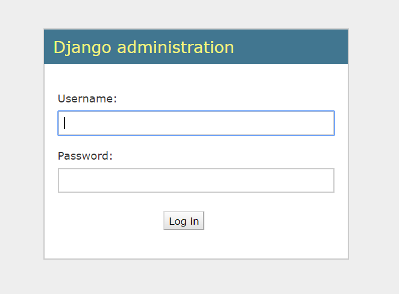

## admin 페이지 만들기

### superuser 생성하기
이제 앞서 생성한 model을 이용하여 컨텐츠를 쉽게 추가, 수정할 수 있는 관리자페이지에 접속해볼 거에요.
우선 django 웹서버를 띄워주세요.
```bash
(django) ~/django$ python manage.py runserver {host IP}:{port}
```

그리고 브라우저에 `{host IP}:{port}/admin`을 타이핑하고 접속해보세요.
아래와 같은 화면이 보이시나요?


아직 우리가 관리자 계정을 생성해주지 않았기 때문에 지금은 접속할 수 없어요.
아래 명령어를 실행하여 관리자 계정을 만들어주세요.
조금 전 `runserver` 명령어로 띄웠던 웹서버를 잠깐 내려도 되고, 별도의 커맨드 창을 켜서 실행하셔도 돼요!
어느 방법으로 하던지 반드시 `workon django` 명령어를 이용해서 가상 환경으로 들어가야 한다는 것 아시죠?
```bash
(django) ~/django$ python manage.py createsuperuser
Username (leave blank to use 'lynn'): 
Email address: admin@lynn-hong.com
Password: 
Password (again): 
Superuser created successfully.
```

이용자가 제대로 생성되었다면 위와 같이 `Superuser created successfully.`라는 말이 뜰 거에요.


### admin에 기본 데이터 추가하기