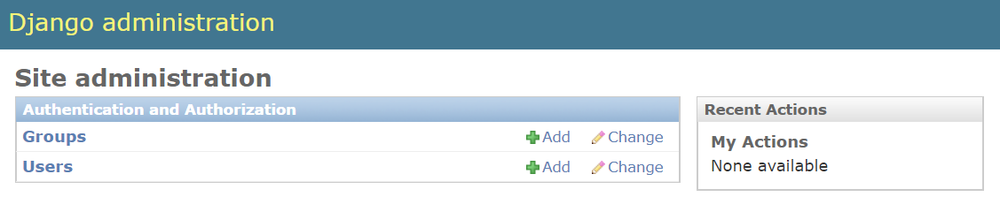
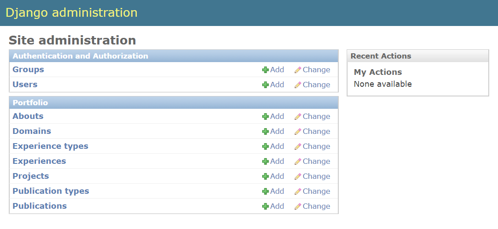
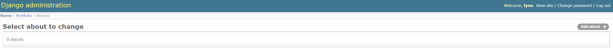
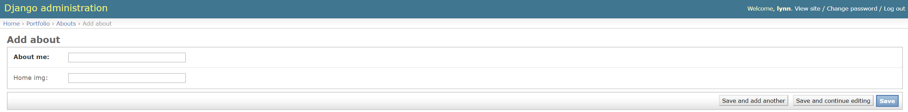

## admin 페이지 만들기

### superuser 생성하기
이제 앞서 생성한 model을 이용하여 컨텐츠를 쉽게 추가, 수정할 수 있는 관리자페이지에 접속해볼 거에요.
우선 django 웹서버를 띄워주세요.
```bash
(django) ~/django$ python manage.py runserver {host IP}:{port}
```

그리고 브라우저에 `{host IP}:{port}/admin`을 타이핑하고 접속해보세요.
아래와 같은 화면이 보이시나요?


아직 우리가 관리자 계정을 생성해주지 않았기 때문에 지금은 접속할 수 없어요.
아래 명령어를 실행하여 관리자 계정을 만들어주세요.
조금 전 `runserver` 명령어로 띄웠던 웹서버를 잠깐 내려도 되고, 별도의 커맨드 창을 켜서 실행하셔도 돼요!
어느 방법으로 하던지 반드시 `workon django` 명령어를 이용해서 가상 환경으로 들어가야 한다는 것 아시죠?
```bash
(django) ~/django$ python manage.py createsuperuser
Username (leave blank to use 'lynn'): 
Email address: admin@lynn-hong.com
Password: 
Password (again): 
Superuser created successfully.
```

이용자가 제대로 생성되었다면 위와 같이 `Superuser created successfully.`라는 말이 뜰 거에요.
이제 관리자 페이지에 아이디와 비밀번호를 입력하고 로그인 해보세요!
아래와 같은 페이지가 보이실 거에요.


그런데 분명 우리는 `About`이라던지 `Domain`이라던지 하는 여러 model 클래스를 만들었는데
여긴 Groups, Users 두 개밖에 보이질 않네요.
그건 우리가 admin view에 다른 클래스들을 추가하지 않았기 때문이에요.
`portfolio/admin.py` 파일을 열어주세요.
```python
from django.contrib import admin

# Register your models here.
```

위와 같은 두 줄만 들어가 있을거에요. 거기에 아래와 같이 내용을 추가해주세요.
내용을 약간 수정하시려면 `portfolio/models.py` 파일을 열어 두고 참고하면서 바꿔주세요!
```python
from django.contrib import admin
from .models import About, Domain, Experience, ExperienceType, Project, Publication, PublicationType


@admin.register(About)
class AboutAdmin(admin.ModelAdmin):
    pass

@admin.register(Domain)
class DomainAdmin(admin.ModelAdmin):
    pass

@admin.register(Experience)
class ExperienceAdmin(admin.ModelAdmin):
    pass

@admin.register(ExperienceType)
class ExperienceTypeAdmin(admin.ModelAdmin):
    pass

@admin.register(Project)
class ProjectAdmin(admin.ModelAdmin):
    pass

@admin.register(Publication)
class PublicationAdmin(admin.ModelAdmin):
    pass

@admin.register(PublicationType)
class PublicationTypeAdmin(admin.ModelAdmin):
    pass
```

그리고 웹 브라우저로 돌아가 admin 페이지를 새로고침 해보세요.
아래와 같이 추가된 클래스 목록이 보이시나요?



더 쉽게 admin 뷰를 추가하는 방법도 있지만 `ModelAdmin`의 하위 클래스 형식으로 만든 이유는
나중에 admin 페이지를 커스터마이징 하기 쉽도록 틀을 만들기 위해서예요.
지금은 이 정도만 있어도 충분하니 일단 넘어갈게요.


### admin에 기본 데이터 추가하기
방금 admin 화면에 추가한 클래스들은 아직 아무 컨텐츠가 없어요.
아무 클래스나 하나 눌러보면 아래와 같이 보일거에요.


우측 상단의 버튼을 눌러 컨텐츠를 하나씩 추가해볼까요?
영문 기준으로 'Add about+'이라고 되어 있는 버튼을 눌러보세요.
아래와 같은 페이지가 나와요. 여기에 샘플 데이터를 넣어주세요.
나중에 쉽게 추가할 수 있으니 지금은 dummy 데이터를 넣어도 돼요.

> 컨텐츠 추가 페이지에서 필드명이 굵은 글씨로 나오는 것은 필수 항목이에요!
이 칸을 채우지 않으면 저장이 되지 않는다는 뜻이에요.


