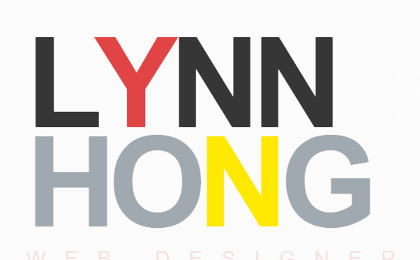

## views 수정하기

***이하의 모든 설명은 `portfolio/templates/portfolio/index.html` 파일 안에서 
이루어집니다. 수정할 파일명이 명시되어 있지 않은 경우에도 이 파일을 확인해주세요!***


### html 파일에서 필요없는 부분 삭제하기
우리가 계획한 포트폴리오 사이트에서 아래 섹션들은 필요가 없으니 삭제할거에요.
`portfolio/templates/portfolio/index.html` 파일을 열어 아래 섹션을 찾아 삭제해주세요.
```html
<!-- ==========================
    BLOG SECTION 
    =========================== -->

(... 생략)

<!-- ==========================
    BLOG SECTION END
    =========================== -->

```

```html
<!-- ==========================
NEWSLETTER SECTION 
=========================== -->

(... 생략)

<!-- ==========================
NEWSLETTER SECTION END
=========================== -->
```

그리고 아래 섹션도 필요 없지만 혹시 나중에 주변 지인들의 'testimonial(헌사)'을 추가하게 될 수 있으니
선택적으로 코멘트 처리를 하시거나 지워주세요.
저는 코멘트 처리만 해 두었어요.

```html
<!-- ==========================
CLIENT SECTION 
=========================== -->

(... 생략)

<!-- ==========================
CLIENT SECTION END
=========================== -->
```


### html 파일에서 fixed 컨텐츠 수정하기
우선 웹 브라우저의 탭에 사용될 이름을 수정해볼게요.
`<title>` 태그를 찾아 자신이 원하는 대로 수정해주세요.
저는 아래와 같이 수정했어요.
```html
<!-- Website Title -->
<title>Lynn Hong - Portfolio site tutorial</title>
```

웹 브라우저로 돌아가서 새로고침을 눌러보세요.
아래와 같이 변경되었어요!


다음은 메인 페이지의 이름을 수정할거에요.
아래 부분을 찾아 수정해주세요.
알파벳 낱글자 하나하나에 `<span>` 태그를 붙이는 방식으로 색깔이 적용되어 있어요.
```html
<!-- HEADER HEADLINE -->
<div class="row">
  <div class="col-md-8 col-md-offset-1 inner">
    <h1 class="animated fadeInDown">
      L<span style="color:#E04343;">y</span>nn<br/>
      <span>Ho<span style="color:#FFE800">n</span>g</span>
```



> **Quiz** 이렇게 알파벳 하나하나에 스타일을 입히는 건 너무 비효율적이고 귀찮은 방식이죠!
이것도 django 클래스로 지정해서 알파벳과 색을 관리할 수 있어요. 어떻게 해야 할까요?


이번에는 상단 메뉴 탭을 수정해볼게요.
사실 이런 메뉴도 django model 클래스화해서 자동으로 화면에 뿌려지도록 할 수 있지만
지금은 변동이 잦지 않을 거라는 가정 하에 그냥 fixed 컨텐츠로 다루도록 할게요.

`HEADER SECTION`을 찾아 `<nav>` 태그 안의 내용을 아래와 같이 수정해주세요.
저는 제 취향대로 아이콘을 변경했어요.
`blog` 탭의 경우 지금은 만들지 않을 거지만 혹시 개인 블로그가 있는 경우
링크하시라고 저는 코멘트 처리만 해 두었어요.
```html
<nav class="menu">
    <!-- Menu Links -->
    <div class="icon-list">
        <a href="#home"><i class="fa fa-fw fa-home"></i><span>Home</span></a>
        <a href="#about"><i class="fa fa-fw fa-quote-left"></i><span>About</span></a>
        <a href="#domain"><i class="fa fa-fw fa-check-circle-o"></i><span>Job Domain</span></a>
        <a href="#academy"><i class="fa fa-fw fa-university"></i><span>Academy</span></a>
        <a href="#work"><i class="fa fa-fw fa-briefcase"></i><span>Work</span></a>
        <a href="#portfolio"><i class="fa fa-fw fa-tasks"></i><span>Portfolio</span></a>
        <!--<a href="#blog"><i class="fa fa-fw fa-rss"></i><span>Blog</span></a>-->
        <a href="#contact"><i class="fa fa-fw fa-envelope-o"></i><span>Contact</span></a>
    </div>
</nav>
```

`<i>` 태그는 아이콘 폰트를 뜻하는데 여기서는 [font awesome](http://fontawesome.io/icons/) 아이콘을 사용해요.
링크된 페이지에서 더 예쁜 다른 아이콘으로 바꾸셔도 돼요!

위에서 수정한 각 `<a>` 태그 라인에서 `<a href="index.html#home">`와 같이 
`#` 뒤에 무언가가 붙어 있는 것 보이시나요?
이건 한 페이지 안에서 특정 위치로 가기 위한 셀렉터(selector)에요.
우리는 `home`, `about`, `domain`, `academy`, `work`, `portfolio`, `contact` 7개의 셀렉터를 지정했으니
실제 그 이름(`id`)을 가진 섹션도 만들어주어야 해요.

`home`, `about`은 이미 있으니 `service` 섹션을 찾아 `domain`으로 바꿔줄게요.
`SERVICE SECTION`을 검색해서 아래와 같이 수정해주세요.
```html

```

