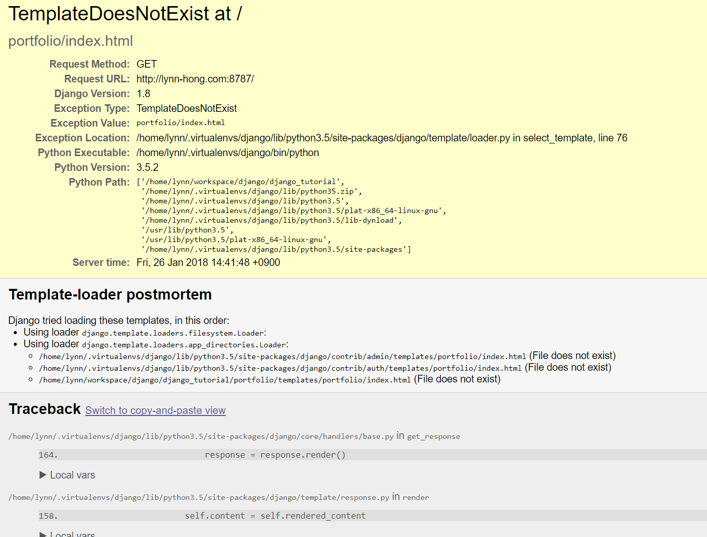
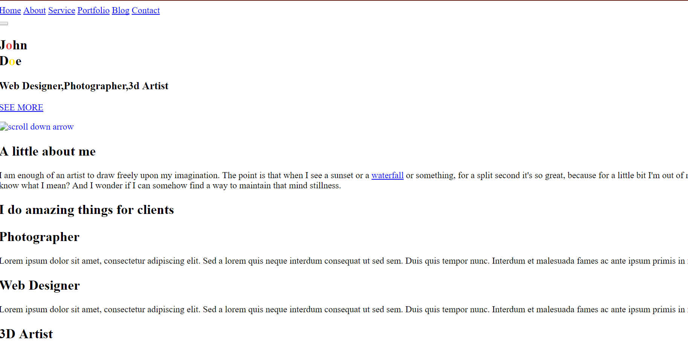
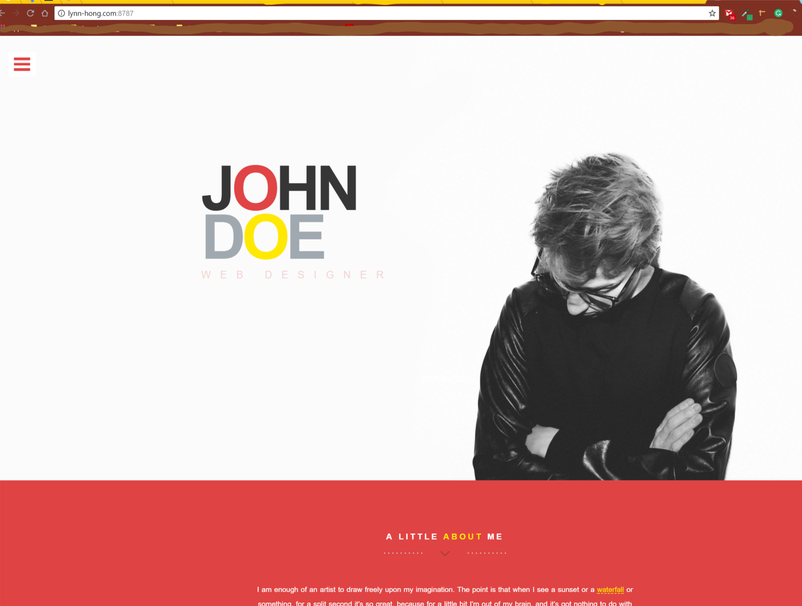

## 템플릿 화면에 띄우기

### view 파일 수정하기
이제 우리가 베이스로 사용하기로 한 html 템플릿을 화면에 띄워 볼게요.
`portfolio/views.py` 파일을 열어 보세요.
```python
from django.shortcuts import render

# Create your views here.
```

위와 같이 두 줄만 들어가 있을 거에요. 이걸 아래 내용으로 바꿔주세요.

django에는 view를 생성하는 방식이 굉장히 많아요!
그 중에서 우리는 `TemplateView`라는 클래스를 상속받아 `Index`라는 클래스를 정의해 주고,
화면에 뿌려질 컨텐츠들을 그 하위 함수를 이용해 가져올 거에요.
```python
from django.views.generic import TemplateView
from .models import About, Domain, Experience, ExperienceType, Project, Publication, PublicationType

class Index(TemplateView):
    template_name = 'portfolio/index.html'
```

아직 여기까지만 하면 화면이 보이지 않아요.
왜냐하면 `Index` 클래스 안에 정의된 `portfolio/index.html` 파일이 없기 때문이에요.



### static, templates 디렉토리 생성하기
이제 각종 템플릿와 css 파일 등을 넣을 디렉토리들을 생성해 볼게요.
`portfolio` 디렉토리 안에 `templates`, `static`이라는 두 개의 디렉토리를 만들어 주세요.
그리고 `templates` 안에는 어플리케이션 이름과 동일한 `portfolio`라는 이름의 디렉토리를 하나 더 만들어 넣어주세요.
그럼 구조가 아래와 같이 보일거에요.
```bash
.
portfolio/
   |-- static/
   |-- templates/
      |-- portfolio/
mysite/
manage.py
... (생략)
```

우리는 `index.html` 파일을 직접 생성하지 않고 아까 다운로드 받아 둔 템플릿을 이용할 거에요.
템플릿 압축 파일을 풀어 'JohnDoe-gh-pages'라는 이름의 디렉토리가 생겼다면,
루트 위치에 있는 `index.html` 파일은 `portfolio/templates/portfolio/` 안으로 옮겨주세요.
그리고 `assets`, `css`, `img`, `js` 파일들은 `portfolio/static/` 안으로 옮겨주세요.

그럼 디렉토리 구조가 아래와 같이 보일거에요.
```bash
.
portfolio/
   |-- static/
      |-- assets/
      |-- css/
      |-- img/
      |-- js/
   |-- templates/
      |-- portfolio/
         |-- index.html
mysite/
manage.py
... (생략)
```

그럼 잠깐 웹 브라우저로 돌아가서 화면이 보이는지 확인해볼까요?
무언가 깨진 느낌이 들지만 컨텐츠는 화면에 나타나네요!



### static 파일 경로 수정하기
무언가 깨져 보인 이유는 `css`, `js` 등의 static 파일들의 경로가 맞지 않기 때문이에요.
django 웹서버를 띄운 커맨드 창으로 가 보면 아래와 같이 404 에러가 표시될거에요.
```bash
System check identified no issues (0 silenced).
January 26, 2018 - 14:23:36
Django version 1.8, using settings 'mysite.settings'
Starting development server at http://0:8787/
Quit the server with CONTROL-C.
[26/Jan/2018 14:38:14]"GET / HTTP/1.1" 200 32110
[26/Jan/2018 14:38:14]"GET /JohnDoe-gh-pages/assets/bootstrap/css/bootstrap.min.css HTTP/1.1" 404 2235
[26/Jan/2018 14:38:14]"GET /JohnDoe-gh-pages/assets/font-awesome/css/font-awesome.min.css HTTP/1.1" 404 2253
[26/Jan/2018 14:38:14]"GET /JohnDoe-gh-pages/assets/textrotator/simpletextrotator.css HTTP/1.1" 404 2241
[26/Jan/2018 14:38:14]"GET /JohnDoe-gh-pages/assets/flexslider/flexslider.css HTTP/1.1" 404 2217
[26/Jan/2018 14:38:14]"GET /JohnDoe-gh-pages/css/style.css HTTP/1.1" 404 2160
[26/Jan/2018 14:38:14]"GET /JohnDoe-gh-pages/assets/lightbox/css/lightbox.css HTTP/1.1" 404 2217
[26/Jan/2018 14:38:14]"GET /JohnDoe-gh-pages/css/animate.css HTTP/1.1" 404 2166
[26/Jan/2018 14:38:14]"GET /JohnDoe-gh-pages/assets/smoothscroll/smoothscroll.js HTTP/1.1" 404 2226
[26/Jan/2018 14:38:14]"GET /JohnDoe-gh-pages/assets/bootstrap/js/bootstrap.min.js HTTP/1.1" 404 2229
...(생략)
```

이를 해결하기 위해 `portfolio/templates/portfolio/index.html` 파일을 열어 주세요.
상단 `<head>` 태그 안에 각종 `.css`, `.js` 파일들이 아래와 같이 링크되어 있어요.
```html
<!-- Bootstrap -->
<link href="../../../JohnDoe-gh-pages/assets/bootstrap/css/bootstrap.min.css" rel="stylesheet">
<!-- Font-Awesome -->
<link href="../../../JohnDoe-gh-pages/assets/font-awesome/css/font-awesome.min.css" rel="stylesheet">
<!-- Lightbox -->
<link href="../../../JohnDoe-gh-pages/assets/lightbox/css/lightbox.css" rel="stylesheet">
```

이렇게 `href`나 `src`, `url`로 경로가 링크되어 있는 부분들을 찾아 아래처럼 수정해주세요.
아직 `html` 페이지로 이동하도록 링크가 되어 있는 부분들은 수정하지 않아도 돼요!
```html
<!-- Bootstrap -->
<link href="" rel="stylesheet">
<!-- Font-Awesome -->
<link href="" rel="stylesheet">
<!-- Lightbox -->
<link href="" rel="stylesheet">
```

그리고 `index.html` 파일의 가장 상단에 아래 한 줄을 추가해주세요.
```html

```

다시 웹 브라우저로 돌아와 새로고침을 눌러보세요.
아래와 같이 제대로 화면이 보일 거에요!



### model과 view 연결하기