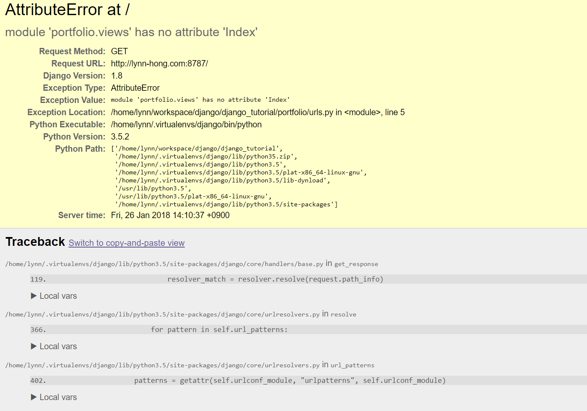

## url 만들기

### 디폴트 url 설정하기
이제 본격적으로 화면에 우리의 예쁜 웹페이지 템플릿을 띄워 볼 거에요!
그러려면 우리의 url이 앞서 웹서버를 올렸을 때 나타나던 'It worked!' 페이지가 아닌 다른 곳을 바라보도록
설정해주어야 해요.
django url은 정규표현식을 기본으로 한답니다.
url에 대한 자세한 추가 설명은 [장고걸스 튜토리얼의 이 페이지](https://tutorial.djangogirls.org/ko/django_urls/)를
참고해주세요!

우선 `mysite/urls.py`라는 파일이 존재할거에요.
파일을 열어서 아래와 같이 수정해주세요.
```python
from django.conf.urls import include, url
from django.contrib import admin

urlpatterns = [
    url(r'^admin/', include(admin.site.urls)),
    url(r'', include('portfolio.urls')),
]
```

`url(r'', include('portfolio.urls')),` 라인을 추가함으로써 우리가 만든 `portfolio` 어플리케이션의 urls을
디폴트 url로 가져올 수 있게 된답니다.


### 어플리케이션 url 설정하기

이제 `portfolio/urls.py`라는 새로운 파일을 생성하고 아래 내용을 추가해주세요.
이 파일에 추가한 url은 자동으로 `mysite/urls.py`에 import될 거에요.
```python
from django.conf.urls import url
from . import views

urlpatterns = [
    url(r'^$', views.Index.as_view(), name='index'),
]
```

여기까지 따라하셨으면 웹 브라우저로 돌아가서 우리의 웹사이트 주소에 접속해보세요.
이전과는 다르게 아래처럼 에러 페이지가 나타날 거에요!


이건 아직 우리가 `portfolio/views.py`에 view 함수들을 정의해주지 않았기 때문이에요.
이제 화면을 예쁘게 꾸며 볼 차례에요!
