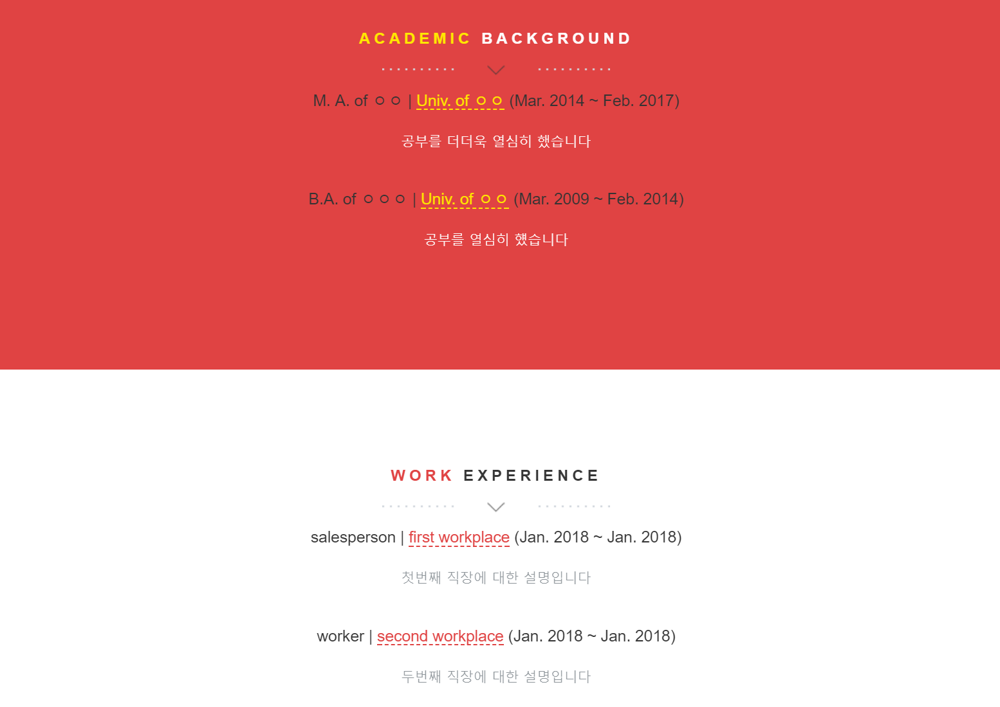

## queryset 함수 만들기

### `views.py`에 함수 만들기

이제 나머지 데이터도 불러와 볼까요?
`portfolio/views.py` 파일을 열어 우리의 `Index` 클래스를 아래와 같이 수정해주세요.

```python
class Index(TemplateView):
    template_name = 'portfolio/index.html'

    def get_context_data(self, **kwargs):
        context = super(Index, self).get_context_data(**kwargs)

        # desc. text of myself
        context['about'] = About.objects.all()

        # contact info
        context['contacts'] = Contact.objects.all()

        # domain
        context['domains'] = Domain.objects.all()

        # work experience
        context['works'] = get_ex("work")

        # educations
        context['edus'] = get_ex("edu")

        return context
```

`about`부터 `domains`까지는 이전에 보던 것처럼 `{모델}.objects.all()` 함수를 이용했는데,
그 이하는 다른 함수가 사용되었네요.
이제부터 우리가 이 함수들을 직접 정의해 볼 거에요.

지금까지 단순히 한 클래스의 모든 데이터를 가져오는 방식을 사용했다면,
이제 쿼리셋 필터를 걸어 볼 거거든요.

우선 `get_ex` 함수부터 정의해볼게요.
static 함수니까 `Index` 클래스 바깥에 넣어주시면 돼요.

```python
def get_ex(ex_type):
    rows = Experience.objects.filter(ex_type__title=ex_type)\
        .extra({'s': "DATE_FORMAT(start, '%%b. %%Y')", 'e': "DATE_FORMAT(end, '%%b. %%Y')"})\
        .values('s', 'e', 'title_kor', 'title_eng', 'location_kor', 'location_eng', 'desc_kor', 'desc_eng')\
        .order_by('-s')
    for entry in rows:
        if entry['e'] is None:
            entry['range_ko'] = "%s - 현재" % entry['s']
            entry['range_en'] = "%s - CURRENT" % entry['s']
        else:
            entry['range_ko'] = "%s - %s" % (entry['s'], entry['e'])
            entry['range_en'] = "%s - %s" % (entry['s'], entry['e'])
    return rows
```

그리고 `portfolio/templates/portfolio/index.html` 파일에서 
`ACADEMIC BACKGROUND SECTION`과 `WORK EXPERIENCE SECTION`를 찾아
아래와 같이 수정해주세요.

```html
<!-- ==========================
ACADEMIC BACKGROUND SECTION
=========================== -->
<section class="intro text-center section-padding color-bg" id="resume">
  <div class="container">
    <!-- WELCOME TEXT -->
    <div class="row">
      <div class="col-md-8 col-md-offset-2 wp1">
        <h1 class="arrow"><span>Academic</span> background</h1><!-- Headline -->
          
          <h3>{{ edu.title_eng }} | <a>{{ edu.location_eng }}</a> ({{ edu.s }} ~ {{ edu.e }})</h3>
          <p style="margin-top: 20px;">{{ edu.desc_kor }}</p>
            <br>
          
      </div>
    </div>
  </div>
</section>


<!-- ==========================
WORK EXPERIENCE SECTION
=========================== -->
<section class="intro text-center section-padding">
  <div class="container">
    <!-- WELCOME TEXT -->
    <div class="row">
      <div class="col-md-8 col-md-offset-2 wp1">
        <h1 class="arrow"><span>Work</span> experience</h1><!-- Headline -->
          
          <h3>{{ work.title_eng }} | <a>{{ work.location_eng }}</a> ({{ work.s }} ~ {{ work.e }})</h3>
          <p style="margin-top: 20px;">{{ work.desc_kor }}</p>
            <br>
          
      </div>
    </div>
  </div>
</section>
```

웹 브라우저로 돌아가 새로고침을 눌러 보면 아래와 같이 자동으로 경력 란이 보이게 되었어요!




