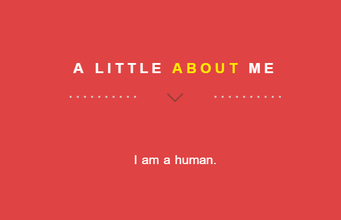

## views 수정하기

***이하를 원활하게 진행하기 위해서는 우리가 앞서 만들었던 모델들에 dummy 컨텐츠가 하나씩이라도 들어가 있어야 해요.
혹시 데이터를 추가하지 않으신 분들은 잠시 멈추고 가짜 데이터라도 하나씩 넣어 주세요!***


### 쿼리셋으로 데이터 하나 뿌려 주기
현재 우리의 `about` 섹션은 아래와 같이 생겼습니다.
`<p>` 태그 안에 나에 대한 설명이 박혀 있는 상태이지요.
```html
<!-- ==========================
ABOUT SECTION  
=========================== -->
<section class="intro text-center section-padding color-bg" id="about">
  <div class="container">
    <!-- WELCOME TEXT -->
    <div class="row">
      <div class="col-md-8 col-md-offset-2 wp1">
        <h1 class="arrow">A little <span>about</span> me</h1><!-- Headline -->
        <!-- about / welcome text -->
        <p>I am enough of an artist to draw freely upon my imagination. The point is that when I see a sunset or a 
            <a href="#">waterfall</a> 
            or something, for a split second it's so great, because for a little bit I'm out of my brain, 
            and it's got nothing to do with me. I'm not trying to figure it out, you know what I mean? 
            And I wonder if I can somehow find a way to maintain that mind stillness.
        </p>
      </div>
    </div>
  </div>
</section>
```

이 부분을 전에 우리가 `About` 모델 안의 `desc_eng` 필드에 추가한 내응으로 자동 렌더링 할 수 있게
바꿔볼게요.
아래와 같이 수정해주세요.
```html
<!-- ==========================
ABOUT SECTION  
=========================== -->
<section class="intro text-center section-padding color-bg" id="about">
  <div class="container">
    <!-- WELCOME TEXT -->
    <div class="row">
      <div class="col-md-8 col-md-offset-2 wp1">
        <h1 class="arrow">A little <span>about</span> me</h1><!-- Headline -->
        <!-- about / welcome text -->
        <p>{{ about.about_me }}</p>
      </div>
    </div>
  </div>
</section>
```

`{{ about.about_me }}`는 `views.py`에서 이 페이지(`index.html`)에 전달된 데이터 중,
'about'이라는 라벨을 가진 것 안에 'about_me' 속성의 값을 뿌려주라는 뜻이에요.

그럼 이번에는 `views.py`를 수정해볼까요?
`portfolio/views.py`로 가서 아래 내용을 추가해주세요.
```python
class Index(TemplateView):
    template_name = 'portfolio/index.html'

    def get_context_data(self, **kwargs):
        context = super(Index, self).get_context_data(**kwargs)

        # desc. text of myself
        context['about'] = About.objects.first()

        return context
```

웹 브라우저로 돌아가서 새로고침을 눌러 보면 `about` 부분이 수정된 것을 확인하실 수 있어요!



`views.py`의 `get_context_data` 함수를 좀더 살펴보면,
이 함수 안에서 각 모델의 형태에 맞게 데이터를 쿼리셋(queryset) 형태로 불러와
return 값인 `context` 안에 넣어줄 거에요.
`context`는 python에서의 사전(dictionary)형의 변수랍니다.


### 쿼리셋으로 데이터 여러 개 뿌려 주기

위에서는 하나의 데이터만을 가져와서 화면에 렌더링해 주었어요.
이번에는 여러 개의 데이터를 가져와서 반복문을 이용해 화면에 보여줄 거에요.
사용할 모델은 `Domain` 입니다.
우선 `index.html` 파일을 열어 아래 부분을 수정해주세요.


### queryset 함수 만들기


```python
class Index(TemplateView):
    template_name = 'portfolio/index.html'

    def get_context_data(self, **kwargs):
        context = super(Index, self).get_context_data(**kwargs)

        # desc. text of myself
        context['about'] = About.objects.all()

        # contact info
        context['contacts'] = Contact.objects.all()

        # domain
        context['domains'] = get_domain()

        # work experience
        context['works'] = get_ex("work")

        # educations
        context['edus'] = get_ex("edu")

        # projects
        context['projects'] = get_project()

        # papers
        context['papers'] = get_publication("paper")

        # reports
        context['reports'] = get_publication("report")

        # awards
        context['awards'] = get_award()

        return context
```


### loop로 뿌려 주기

