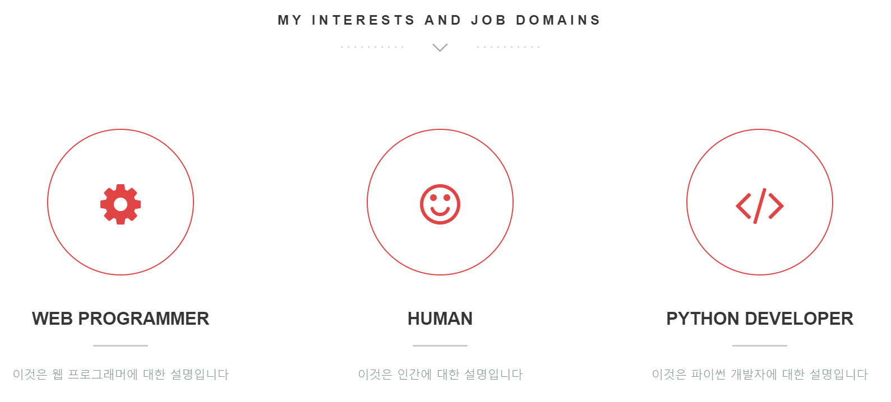
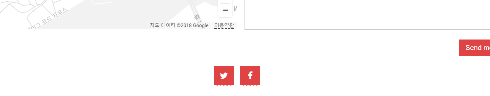
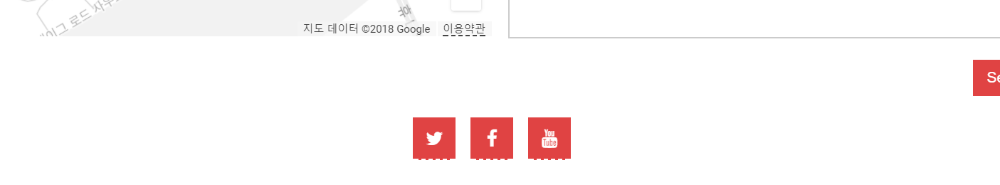

## views 수정하기

***이하를 원활하게 진행하기 위해서는 우리가 앞서 만들었던 모델들에 dummy 컨텐츠가 하나씩이라도 들어가 있어야 해요.
혹시 데이터를 추가하지 않으신 분들은 잠시 멈추고 가짜 데이터라도 하나씩 넣어 주세요!***


### 쿼리셋으로 데이터 하나 뿌려 주기
현재 우리의 `about` 섹션은 아래와 같이 생겼습니다.
`<p>` 태그 안에 나에 대한 설명이 박혀 있는 상태이지요.
```html
<!-- ==========================
ABOUT SECTION  
=========================== -->
<section class="intro text-center section-padding color-bg" id="about">
  <div class="container">
    <!-- WELCOME TEXT -->
    <div class="row">
      <div class="col-md-8 col-md-offset-2 wp1">
        <h1 class="arrow">A little <span>about</span> me</h1><!-- Headline -->
        <!-- about / welcome text -->
        <p>I am enough of an artist to draw freely upon my imagination. The point is that when I see a sunset or a 
            <a href="#">waterfall</a> 
            or something, for a split second it's so great, because for a little bit I'm out of my brain, 
            and it's got nothing to do with me. I'm not trying to figure it out, you know what I mean? 
            And I wonder if I can somehow find a way to maintain that mind stillness.
        </p>
      </div>
    </div>
  </div>
</section>
```

이 부분을 전에 우리가 `About` 모델 안의 `desc_eng` 필드에 추가한 내용으로 
자동 렌더링 할 수 있게 바꿔볼게요.
아래와 같이 수정해주세요.
```html
<!-- ==========================
ABOUT SECTION  
=========================== -->
<section class="intro text-center section-padding color-bg" id="about">
  <div class="container">
    <!-- WELCOME TEXT -->
    <div class="row">
      <div class="col-md-8 col-md-offset-2 wp1">
        <h1 class="arrow">A little <span>about</span> me</h1><!-- Headline -->
        <!-- about / welcome text -->
        <p>{{ about.about_me }}</p>
      </div>
    </div>
  </div>
</section>
```

`{{ about.about_me }}`는 `views.py`에서 이 페이지(`index.html`)에 전달된 데이터 중,
'about'이라는 라벨을 가진 것 안에 'about_me' 속성의 값을 뿌려주라는 뜻이에요.

그럼 이번에는 `views.py`를 수정해볼까요?
`portfolio/views.py`로 가서 아래 내용을 추가해주세요.
```python
class Index(TemplateView):
    template_name = 'portfolio/index.html'

    def get_context_data(self, **kwargs):
        context = super(Index, self).get_context_data(**kwargs)

        # desc. text of myself
        context['about'] = About.objects.first()

        return context
```

`About.objects.first()` 함수는 `About` 모델에 저장된 데이터 중 하나만 가져오라는 뜻이랍니다.
이 모델에는 항상 하나의 데이터만 들어갈 예정이기 때문에 `first()` 함수를 써 주었어요.
웹 브라우저로 돌아가서 새로고침을 눌러 보면 `about` 부분이 수정된 것을 확인하실 수 있어요!


`views.py`의 `get_context_data` 함수를 좀더 살펴보면,
이 함수 안에서 각 모델의 형태에 맞게 데이터를 쿼리셋(queryset) 형태로 불러와
return 값인 `context` 안에 넣어줄 거에요.
`context`는 python에서의 사전(dictionary)형의 변수랍니다.


### 쿼리셋으로 데이터 여러 개 뿌려 주기

위에서는 하나의 데이터만을 가져와서 화면에 렌더링해 주었어요.
이번에는 여러 개의 데이터를 가져와서 반복문을 이용해 화면에 보여줄 거에요.
사용할 모델은 `Domain` 입니다.
우선 `index.html` 파일을 열어 `DOMAIN SECTION`을 찾아주세요.
아래와 같이 3개의 박스들이 하드코딩 되어 있어요.

```html
<!-- Service Box 1 -->
(생략)
<!-- Service Box 2 -->
(생략)
<!-- Service Box 3 -->
```

우리는 여기에 반복문을 이용해서 `Domain` 모델에 넣어 준 데이터를 자동으로 뿌려 줄 거에요.
`DOMAIN SECTION`을 아래와 같이 수정해주세요.
```html
 <!-- ==========================
    DOMAIN SECTION
 =========================== -->
    <section class="features text-center section-padding" id="domain">
      <div class="container">
    <!-- Headline -->
        <div class="row">
          <div class="col-md-12">
            <h1 class="arrow">My interests and job domains</h1>
          </div>
        </div>
        <div class="row">
          <div class="col-md-12">
              <div class="services">
              
              <!-- Domain Box -->
                      <div class="col-md-4 wp2 item">
                        <div class="icon">
                          <i class="fa {{ domain.icon }}"></i><!-- Icon -->
                        </div>
                        <h2>{{ domain.title_eng }}</h2><!-- Title -->
                        <p>{{ domain.desc_kor }}</p><!-- Description -->
                      </div>
              
              </div>
              <div class="clearfix"></div>
          </div>
        </div>
      </div>
    </section>
```

`portfolio/views.py` 파일로 가서 아래와 같이 `domain` 부분을 추가해주세요.

```python
class Index(TemplateView):
    template_name = 'portfolio/index.html'

    def get_context_data(self, **kwargs):
        context = super(Index, self).get_context_data(**kwargs)

        # desc. text of myself
        context['about'] = About.objects.first()

        # domain
        context['domains'] = Domain.objects.all()
```

짠! 아래와 같이 데이터가 자동으로 렌더링되었어요!




### 단순 쿼리셋으로 나머지 데이터 가져오기
이제 나머지 부분들도 위와 같은 식으로 수정해볼게요.

`Contact` 모델도 단순한 형태의 쿼리셋을 이용해 렌더링을 할 수 있어요.
`index.html` 파일에서 `Social Buttons` 부분을 찾아 아래와 같이 수정해주세요.
`<div>` 태그를 삭제하거나 수정할 때에는 꼭 짝이 맞는지 잘 확인하고 해 주세요!
```html
<!-- Social Buttons - use font-awesome, past in what you want -->
<div class="row">
  <div class="col-md-12">
    <ul class="social-buttons">
      
          <li>
              <a href="{{ contact.c_url }}" class="social-btn"><i class="fa {{ contact.icon }}"></i>
              </a>
          </li><!-- {{ contact.title }} -->
      
    </ul>
  </div>
</div>
```

그리고 `portfolio/views.py` 파일로 가서 아래와 같이 `contact`를 추가해주세요.

```python
class Index(TemplateView):
    template_name = 'portfolio/index.html'

    def get_context_data(self, **kwargs):
        context = super(Index, self).get_context_data(**kwargs)

        # desc. text of myself
        context['about'] = About.objects.first()

        # domain
        context['domains'] = Domain.objects.all()

        # contact info
        context['contacts'] = Contact.objects.all()
```





`{host}:{port}/admin`로 접속해서 admin 페이지에서 contact 데이터를 하나 추가해 보면,
html 코드를 수정하지 않아도 아래와 같이 아이콘이 하나 늘어나게 돼요.


